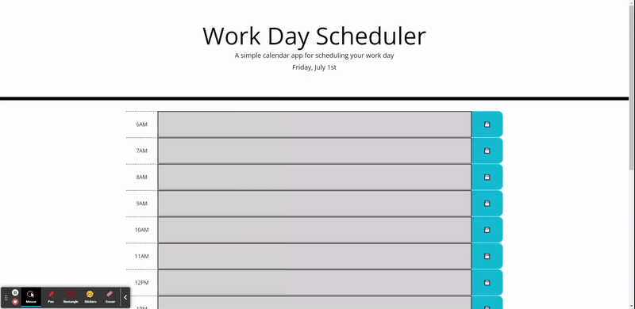
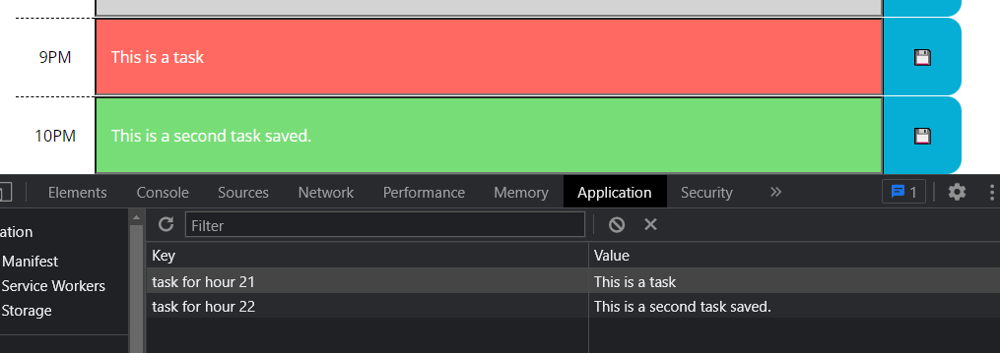
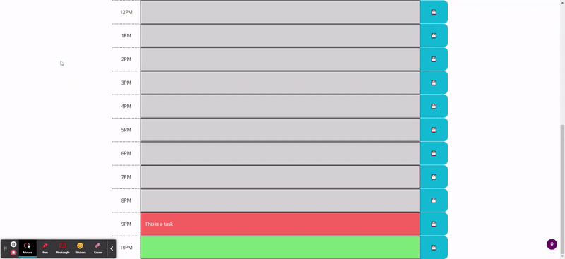

# Work Day Scheduler

## Description 

Welcome to Work Day Scheduler.

This project aims to showcase my ability in utilizing Third Party APIs by presenting a work day planner with dynamically updating timeblocks that allow the user to input a task:



and storing user tasks locally:




## Usage

In order to do this project, I used Third Party APIs such as JQuery, Bootstrap, and Moment.js in addition to Javascript, HTML, CSS, git and github.

I reference and manipulate HTML elements through JQuery's `$()` selector and its methods, as well as styling them with Bootstrap classes.
```
var container = $(".container");
var groupDiv = $("<div>").addClass("row time-block");
var timeDiv = $("<div>").text(timeString(i)).addClass("hour col-1");
var noteDiv = $("<input>").addClass("justify-content-center col-10 " + timeColor(i))
```

I use Moment.js to format and display current date and time information.
```
currentDay.text(moment().format("dddd, MMMM Do"));
```

## Links

[Deployed Website](https://zzzorigtbaatar.github.io/Work-Day-Scheduler/)

[Project Repository](https://github.com/zzzorigtbaatar/Work-Day-Scheduler)

## Credits

* Jerome Chenette, UC Berkeley Extension Coding BootCamp

* https://getbootstrap.com/docs/5.2/getting-started/introduction/

* https://api.jquery.com/

* https://momentjs.com/docs/

## License

[LICENSE](/LICENSE)

## Contact

https://www.linkedin.com/in/zorizulkhuu/

https://zzzorigtbaatar.github.io/My-Portfolio